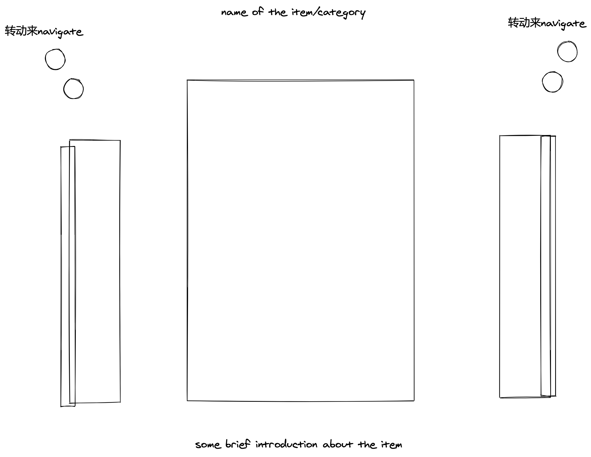

# Catch app

包含三个点

* inventory [物品](./inventory/index.md)
* activity [活动](./activity/index.md)
* data [数据](./data/index.md)

整个App分为读写部分: 长按取反, 应该按到每一个地方都有对应的编辑功能

##Inventory

物品指固定资产, 包括 衣服, 身体状况, 数码产品, 房子等等

对固定资产主要是展示, 包含一定的归类属性(目的是为了更好的展示)

排序:

按照顺序将使用最多的种类放在前方, 其他的放在后方

归类动画展示:

最终的物品展示: 试图创建类似bear一样的文本工具体验

## Activity

活动指的是一段时间内的行为, 可以包含很多物品或者包含其他的活动

主要包含归类、创建和履行

在每一个活动上可以增加标签, 自带的标签包括 时间, 地点, 长度, 天气等, 可以自带标签

## data

是由标签数据衍生出来的, 有排序标签(list), 有种类标签(map), 还有2元标签(boolean)

根据一定的规则可以在首页给出一些常规的展示

也可以根据自身的需求选择标签来进行查看相关数据

