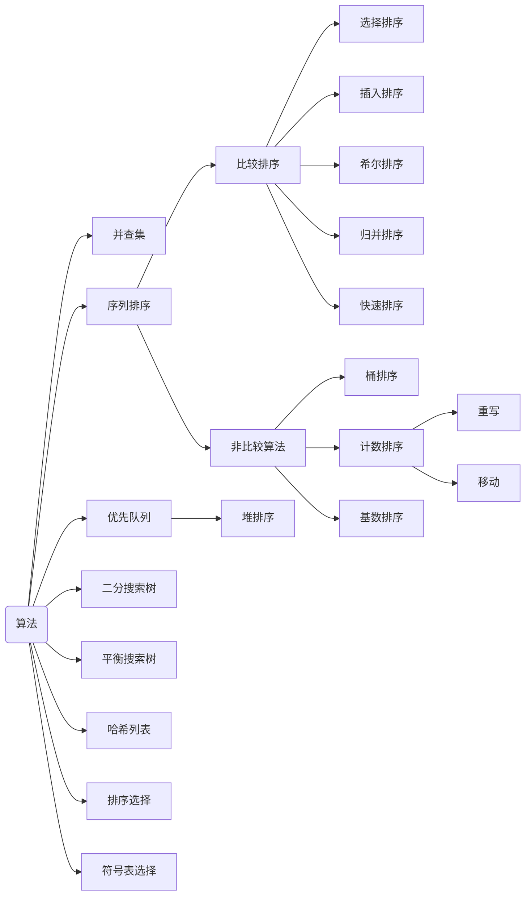

# 算法

## 目录

## 术语

|       术语       |                 描述                  |
| :------------------------: | :---------------------------------------------: |
|          shuffing          |                 在每一个排序的对象生成一个对应的随机值作为key， 然后将整个数组按照key排序                 |
|         comparable         | 拥有compareTo方法， 返回负值表示小于， 正值表示大于， 0为等于 |
|          iterable          |  |
|           stable           | 排序后相同值的位置和排序前一致 |
|          in-place          | uses <= clogN extra memory |
| 理论可实现基于比较的排序的性能 |  |

## [比较算法排序性能](./GeneralSort/Comparison/index.md)

## [非比较算法排序性能](./GeneralSort/NonComparison/index.md)

## 符号表实现

## BST应用

  