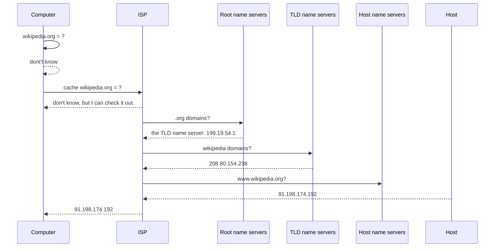

# Internet: A distributed packet-switched network

[Course](https://www.khanacademy.org/computing/ap-computer-science-principles/the-internet/wires-wifi-physical-network-connections/v/the-internet-wires-cables-and-wifi)

To create a global network of computers, we need:

- **Wires & wireless**: Physical connections between computers.

    latency: time takes for a bit from one place to another

    bandwidth: maximum bit rate of a system, 100Mbps: cannot transfer more than 100 Mb / s

    | Type                   | Sends       | Distance | Bandwidth | Issues            |
    | :--------------------- | :---------- | :------- | :-------- | :---------------- |
    | Wireless               | Radio       | 100 ft   | 1.3 Gbps  | Slower in reality |
    | Ethernet copper cables | Electricity | 330 ft   | 1 Gbps    | Can lose data     |
    | Fiber optical cable    | Light       | 50 miles | 26 Tbps   | Expensive         |

- **IP & DNS**:  Addressing protocols to uniquely identify all the computers on the Internet.

    **IP**: internet protocal

    IPV4: 32位

    IPV6: 128位

    In actuality, addresses are typically split in the middle of the octets.

    The first 16 bits might route to all of UMich,

    the next 2 bits route to a specific UMich school

    and the final 14 bits route to individual computers.

    **DNS**：Domain name system

    ​			connect domain name -> ip address

    三个部分：

    third-level-domain.second-level-domain.top-level-domain

    top-level-domain:  .com, .org, .edu etc

    second-level-domain: unique name like google khanacademy

    third-level-domain: subdomain, m.wikipedia.org: mobile-optimized wikipedia

    ### Domains <-> IP address

	### DNS Spoofing: change the domain name to another address， communicate to eachother 

- **TCP/IP**: Protocols to reliably route packets of data from one computer to another.

    1. split the message to packets

    

    2. send packet to router

        

    3. router receives packet:  the desination IP address is 91.198.174.192

        

    4. router forwards packet

        

        

        Router use forward table helps it pick the next path.

    5. #### Final router forwards message

        | IP address prefix | path   |
        | :---------------- | :----- |
        | `91.112`          | #1     |
        | `91.198.174.192`  | Direct |
        | `192.92`          | #2     |

        

        ### 互联网冗余增加 容错性 fault-tolerant

        

        损失了线路2， 线路1或者线路3仍然可以通行

        [TCP:](https://www.khanacademy.org/computing/ap-computer-science-principles/the-internet/tcp-fault-tolerant-transmission-protocol/a/transmission-control-protocol-tcp) 

- **TLS**: A secure protocol for sending data without letting everyone else on the Internet read it.
    为什么可以用公钥加密， 私钥解密

    RSA

    P1, P2是质数
    
    N = P1 * P2
    
    欧拉公式：
    $$
    \Phi(P1 * P2) = (P1 - 1) * (P2 - 1)
    $$
    
    $$
    m^{\Phi(P1 * P2)} mod (P1 * P2) = 1
    $$
    
    $$
    m^{k * \Phi(P1 * P2) + 1} mod (P1 * P2) = m
    $$
    
    $$
    令 e*d = k * \Phi(P1 * P2) + 1
    $$
    
    $$
    d = \frac{k * \Phi(P1 * P2) + 1}{e}
    $$
    
    首先将N和e传递给client
    
    client用来加密
    $$
    c = m^e mod N
    $$
    client用d和N解密
    $$
    m = m^{e*d} mod N
    $$
    
    $$
    m = c ^ d mod N
    $$
    
    
    
- **HTTP & HTML**: Common protocols and formats for sharing documents and viewing them across any type of computer.

