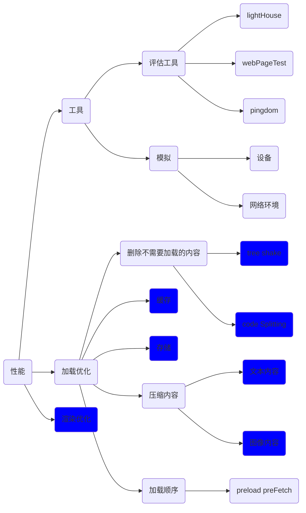

# performace

使用Rail模型评估性能

通过评估以下几个方面来评估性能

| 主要方面 |  |  |  |  |
| :------: | ------------------------------------------------------------ | ------------------------------------------------------------ | ------------------------------------------------------------ | ------------------------------------------------------------ |
|   描述   | 立即响应用户，在100ms确认用户输入                            | 在10ms内生成帧                                               | 最大程度增加主线程的空闲时间                                 | 持续吸引用户，在1000m s内呈现交互内容                        |
|   场景   | 点击按钮，表单输入， 启动动画, 在100ms响应，如果不能在500ms内完成， 需要向用户反馈 | 因为每一帧需要经过这些步骤， js计算和style会提前做完，layout的更改会影响后续操作，只是绘制的话会跳过paint, 最好既不影响layout也不影响paint | 空闲时间可以用来加载推迟之后的任务， 利用空闲时间加载剩余数据 | 在1s内加载网站                                               |

##  提高性能的方案



## 网络安全


### tree shake

- use ESM (ie import and export)

- @babel/preset-env模块会转化成commonJS模块

    ```json
    "presets": [
        ["env", {
          "modules": false
        }]
      ]
    ```

- sideEffets to package.json file

    ```json
    {
      "name": "your-project",
      "sideEffects": [
        "./src/some-side-effectful-file.js"
      ]
    }
    ```

### code splitting

- vendor 拆分，降低公共代码或应用程序更改时使用户的缓存失效
- 入口拆分 多页面时将各个页面的资源进行拆分， 方便在不同时候进行加载
- 动态拆分 使用动态import 语句进行代码拆分

### http cache

- cache-control

    | No-cache       | 每次请求必须进行验证来决定是否使用                |
    | -------------- | ------------------------------------------------- |
    | no-store       | 不缓存                                            |
    | private        | 浏览器可以缓存， 但是无法被中间件缓存， 比如proxy |
    | public         | 响应可以被缓存                                    |
    | max-age=233223 | 多少秒后失效                                      |

    ```tsx
    Cache-Controller: public, max-age=31536000
    ```

    

- ETag

    Request: if-None-Match: X234dff

    Response: statusCode

    Cache-control: max-age = 120

    etag: x234dff

    

- Last-modified

    是ETag的备用机制， 精度比ETag低

versioned URLs 

如果某个模块更改的频次比较低， 可以使用缓存， 然而在缓存期限内， 内容发生了更改，不同的url用来区分是否内容发生了更改，从而来更新缓存内容

### storage

[Cache api](https://web.dev/cache-api-quick-guide/)

[indexDB](https://developers.google.com/web/fundamentals/instant-and-offline/web-storage/indexeddb-best-practices?hl=zh-cn)

### compress text content

- Minify code
- compress 无损

### compress image

- 选择合适image

- remove metadata

- resize iamge

- corp

### render performance

1. 处理 HTML 标记并构建 DOM 树。

2. 处理 CSS 标记并构建 CSSOM 树。

3. 将 DOM 与 CSSOM 合并成一个渲染树。

4. 根据渲染树来布局，以计算每个节点的几何信息。

5. 将各个节点绘制到屏幕上。

### 渲染阻塞

css解析阻塞DOM的构建

js解析阻塞DOM CSSOM的构建


​    


